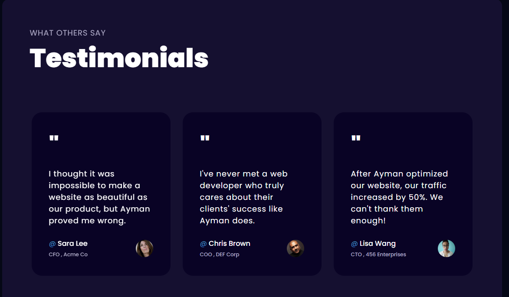

# Ayman Ezzeldin Portfolio

Welcome to my personal portfolio! This website showcases my work, projects, and skills as a front-end developer. It’s a hub for anyone who wants to learn more about my journey, the technologies I work with, and the projects I've built.

## Table of Contents

- [About](#about)
- [Features](#features)
- [Technologies](#technologies)
- [Installation](#installation)
- [Usage](#usage)
- [Screenshots](#screenshots)
- [Contributing](#contributing)
- [License](#license)

## About

This portfolio is designed to present my work as a front-end developer. It highlights my skills in web development, my recent projects, and my professional journey. You can also find links to my social media profiles and contact information.

## Features

- **Project Showcase**: Displays the key projects I’ve worked on.
- **Skills Section**: Lists the technologies and tools I specialize in.
- **Contact Form**: Allows users to get in touch with me directly through the website.
- **Responsive Design**: Fully optimized for all devices—desktop, tablet, and mobile.

## Technologies

- HTML
- CSS
- Tailwind CSS
- JavaScript
- Next js
- Three js

## Installation

If you'd like to run this project locally:

1. Clone the repository:

```
git clone https://github.com/ayman-ezzeldin/ayman_ezz.git
```
2.Install the dependencies:
``` 
npm install
```

3.Start the development server:
```
npm run dev
```
## Screenshots

Here are some screenshots of my portfolio:

### Home Page


### Experience Page


### Projects Section


### Testimonials Section


### Contact Form


## Usage

### Navigating the Portfolio

1. **Home Page**: Learn about me, my experience, and a brief introduction.
2. **Projects Section**: Browse through my key projects, with descriptions and links to live demos or GitHub repositories.
3. **Skills Section**: See the list of technologies I’m proficient in.
4. **Contact Form**: Reach out to me directly by filling out the form with your contact details and message.
5. **Responsive Design**: The portfolio is optimized to work seamlessly on desktops, tablets, and mobile devices.

The platform provides an easy-to-navigate interface for visitors to explore my work and get in touch with me.
